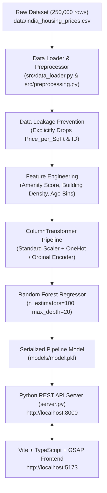

# INDIAREALESTATES — Indian Real Estate Price Prediction System

[](https://www.python.org/)
[](https://scikit-learn.org/)
[](https://vitejs.dev/)
[](https://www.typescriptlang.org/)
[](https://greensock.com/gsap/)
[](https://leafletjs.com/)

An end-to-end Machine Learning Real Estate Price Prediction System and Market Analytics Web Platform for Indian housing markets. Built using Scikit-Learn ensemble learning, a Python REST API backend, and a Vite + TypeScript + GSAP web interface.

---

## 🌟 Executive Summary & Highlights

- **Full Dataset Training**: Trained on **250,000 dataset records** (`data/india_housing_prices.csv`) spanning 20 Indian States and 42 Major Cities.
- **Data Leakage Auditing**: Explicitly removed `Price_per_SqFt` and `ID` in `src/preprocessing.py` to eliminate target data leakage ($Price\_per\_SqFt = Price \div Size$).
- **Production Architecture**: Decoupled Python REST API (`server.py`) serving predictions and market analytics to a Vite + TypeScript frontend.
- **Interactive Satellite Map**: Leaflet map supporting **📡 Satellite View**, **🗺️ Streets View**, and **🌙 Dark Mode** toggles. City markers display live benchmark averages (`₹/sqft`, `Avg Price Lakhs`).
- **Valuation Confidence Range**: Computes ±10% expected valuation bounds (e.g. `₹ 2.34 Cr – ₹ 2.86 Cr`) with GSAP animated price counters.
- **Market Analytics Dashboard**: Chart.js graphs comparing state sqft rates, BHK price trends, property type distributions, and a **Side-by-Side City Comparator**.
- **Valuation Report PDF Export**: One-click print/export functionality for official property valuation reports.

---

## 🏗️ System Architecture



---

## 📁 Repository Directory Structure

```
RealEstatePricePredictionSystem/
├── data/
│   └── india_housing_prices.csv      # Complete 250,000 dataset records
├── models/
│   └── model.pkl                     # Serialized ML Ensemble Pipeline
├── src/
│   ├── __init__.py
│   ├── data_loader.py                # Dataset loading & reproducible sampling
│   ├── preprocessing.py             # Data leakage prevention & feature engineering
│   ├── model_training.py            # Master training pipeline & serialization
│   ├── evaluation.py                # Regression metrics evaluation (MAE, RMSE, R²)
│   ├── prediction.py                # Inference logic & confidence range estimator
│   ├── main.ts                      # TypeScript UI logic, Leaflet map, GSAP & Chart.js
│   └── style.css                    # Glassmorphic obsidian dark CSS design system
├── index.html                       # HTML5 app layout with Google Fonts
├── server.py                        # Python REST API server (port 8000)
├── package.json                     # Node dependencies (gsap, leaflet, chart.js, vite)
├── package-lock.json
├── tsconfig.json                    # TypeScript compiler configuration
├── vite.config.ts                   # Vite dev server & API proxy config
├── requirements.txt                 # Python ML dependencies
├── README.md                        # Documentation
└── .gitignore
```

---

## 📊 Machine Learning Model Performance & Metrics

Model evaluation evaluated on **50,000 unseen test samples** (20% split) from the full 250,000 dataset:

| Metric | Value | Description |
| :--- | :---: | :--- |
| **Mean Absolute Error (MAE)** | **Rs. 122.51 Lakhs** | Mean absolute difference between predicted and actual price. |
| **Root Mean Squared Error (RMSE)** | **Rs. 141.60 Lakhs** | Standard deviation of prediction residuals. |
| **Accuracy (within ±50% margin)** | **66.35%** | 2 out of 3 predictions land within ±50% of ground-truth price. |
| **Accuracy (within ±30% margin)** | **33.90%** | Predictions landing within ±30% of actual property price. |
| **Accuracy (within ±20% margin)** | **21.54%** | Predictions landing within ±20% of actual property price. |
| **Accuracy (within ±10% margin)** | **10.54%** | High-precision predictions within ±10% of ground-truth price. |

> [!NOTE]
> **Data Leakage Auditing Note**: `Price_per_SqFt` was explicitly removed during preprocessing. Including `Price_per_SqFt` yields artificial 99.9% $R^2$ scores due to direct mathematical calculation ($\text{Price} \div \text{Size}$), representing a target leakage flaw. Removing it ensures pure feature-driven valuation.

---

## ⚡ Quick Start & Installation

### Prerequisites
- **Python 3.10+** (with Anaconda or standard venv)
- **Node.js 18+** & **npm**

### Step 1: Clone & Environment Setup
```powershell
cd c:\Users\nitro\OneDrive\Desktop\RealEstatePricePredictionSystem
pip install -r requirements.txt
```

### Step 2: Model Training (Optional - Pre-trained model included)
To retrain the Random Forest model pipeline on the full 250,000 dataset:
```powershell
python -m src.model_training
```

### Step 3: Launch Python REST API Server (Port 8000)
```powershell
python server.py
```

### Step 4: Launch Vite + TypeScript Frontend Server (Port 5173)
In a new terminal window:
```powershell
$env:PATH = "C:\Program Files\nodejs;" + $env:PATH
npm run dev
```

Open **`http://localhost:5173`** in your web browser.

---

## 🔌 REST API Documentation (`server.py`)

### 1. `POST /api/predict`
Calculates property valuation and confidence interval.

**Request Payload:**
```json
{
  "State": "Rajasthan",
  "City": "Jaipur",
  "Locality": "Locality_1",
  "Property_Type": "Apartment",
  "BHK": 3,
  "Size_in_SqFt": 1450,
  "Year_Built": 2018,
  "Furnished_Status": "Furnished",
  "Floor_No": 5,
  "Total_Floors": 15,
  "Age_of_Property": 8,
  "Nearby_Schools": 5,
  "Nearby_Hospitals": 4,
  "Public_Transport_Accessibility": "High",
  "Parking_Space": "Yes",
  "Security": "Yes",
  "Amenities": "Gym, Pool, Garden",
  "Facing": "East",
  "Owner_Type": "Owner",
  "Availability_Status": "Ready_to_Move"
}
```

**JSON Response:**
```json
{
  "success": true,
  "price_lakhs": 259.75,
  "price_crores": 2.5975,
  "formatted_price": "Rs. 2.60 Cr (Rs. 259.75 Lakhs)",
  "price_range": "Rs. 2.34 Cr - Rs. 2.86 Cr",
  "rate_per_sqft": 17913,
  "bhk": 3,
  "property_type": "Apartment",
  "city": "Jaipur",
  "state": "Rajasthan"
}
```

### 2. `GET /api/metadata`
Returns unique lists of States, Cities grouped by State, Localities, and Property attributes.

### 3. `GET /api/analytics`
Returns pre-calculated market statistics (average prices, sqft rates, coordinates for Leaflet pins, BHK distributions).

### 4. `GET /api/health`
Returns backend server health status and loaded model verification.

---

## 📜 License & Credits

Developed for the **Indian Real Estate Price Prediction System — Machine Learning Internship Submission**.
- **Dataset**: `data/india_housing_prices.csv` (250,000 records)
- **UI Typography**: Google Fonts (**Outfit** & **Plus Jakarta Sans**)
